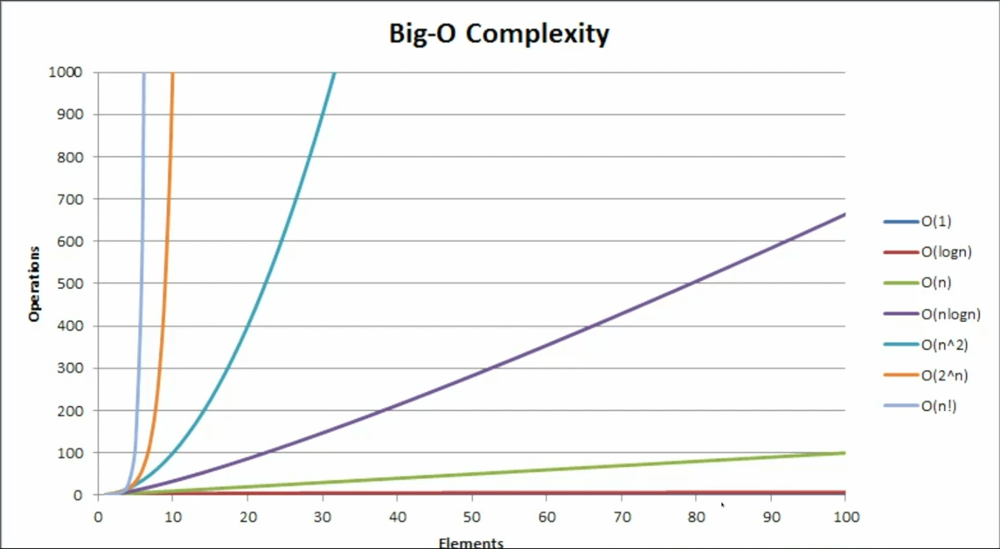

# Whats is Big O

It categorizes algorithms based on their running time or memory requirements as
the input grows.

This helps you understand how your algorithm will perform as the input grows.

## Why do we use it?

It helps us make decisions about what data structures and algorithms to use.

## Important concepts

### 1. growth is with respect to the input size

#### In the real world

This things are not neccesarily without tradeoffs.

Memory growing is not computationally free, but in the matter of thinking about
algorithms, we don't necessarily think about that.

You can't trade time for memory, because it takes time to create memory. If you
create a linear amount of memory, your algorithm is bound to how much memory you
create.

### 2. Constants are dropped

`O(2n)` -> `O(n)` and this makes sense. That is because Big O is meant to
describe the upper bound of the algorithm (the growth of the algorithm). The
constant eventually becomes irrelevant.

We are not trying to get exact time. It's how does it grow. If I will have
`O(n)` with 10,000 as `n`, it is gonna hold my computer or am I gonna be able to
do it fast? Is it going to be instant? That's what we are trying to figure out.

### 3. Worst case is usually the way we measure

Whenever you are doing an interview, rarely will you be asked about the best
case or the average case.

## Practical vs theoretical differences

`O(n)` is faster than `O(n^2)`, but just like in sorting algorithms often will
use insertion sort for smaller subsets of data, because insertion sort, though
slower in theoretical terms, because it's `O(n^2)`, it's actually faster than
say QuickSort, which is `O(n log n)`, when it comes to smaller datasets.

Practically speaking, sometimes things that are n squared (`O(n^2)`) are faster
than n (`O(n)`) because `n` is sufficiently small and the constant that is
dropped is larger enough that it actually makes real impact.

## Example: How does our program's execution time grow with respect to the input?

The for has to execute the length of the string. It grows linearly. For every
one more unit of string, there is one more loop that it has to do.

```ts
function sum_char_codes(n: string): number {
  let sum = 0
  for (let i = 0; i < n.length; i++) {
    sum += n.charCodeAt(i)
  }
  return sum
}
```

## Simplest trick for complexity

Look for loops. Where do you loop over your input? If you see that, it's the
easiest way to tell what your complexity is.

## What's the running time of this function?

We could think of this as `O(2n)`, but it's not that. **You always drop
constants**.

```ts
function sum_char_codes(n: string): number {
  let sum = 0

  for (let i = 0; i < n.length; i++) {
    sum += n.charCodeAt(i)
  }

  for (let i = 0; i < n.length; i++) {
    sum += n.charCodeAt(i)
  }

  return sum
}
```

## Example: Return the sum when the char is 'E'

Here, the complexity would be `O(n)` because in Big O **we often consider the
worst case**.

Therefore, any string with E in it will terminate early (unless E is the last
item in the list).

> **It's still `O(n)`**

```ts
function sum_char_codes(n: string): number {
  let sum = 0

  for (let i = 0; i < n.length; i++) {
    const charCode = n.charCodeAt(i)
    // Capital E
    if (charCode === 69) {
      return sum
    }

    sum += charCode
  }

  return sum
}
```

## The common complexities

1. `O(1)` - Constant time


